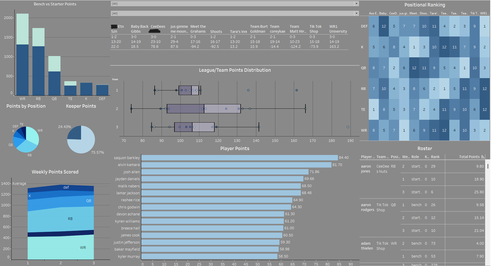

# Fantasy Football Dashboard

## Project Overview
This is a personal project I took on for the benefit of myself as well as the rest of my fantasy football league members. The goal is to create an up-to-date dashboard that helps owners better understand and manage their fantasy teams.   

In this project, a database is created in MySQL Workbench 8.0 using data pulled from Sleeper API and data downloaded from FantasyPros. The database is connected to Tableau that has a custom dashboard built to better understand and display the data.   

The dashboard link can be found here: https://public.tableau.com/app/profile/coleton.reitan7808/viz/OuahFantasyLeague/TeamDash

### Dashbaord Screenshot

## Creation Process
This was a multi-step process that involved creating a database from scratch in MySQL, importing and cleaning data from Sleeper and FantasyPros, uploading data into the MySQL database, and finally creating the dashboard.  
Following the dashboard creation, it is updated every week for new fantasy league data. 

### 1) Creating SQL Database
SQL commands were ran in Jupyter Notebook with Python using the mysql.connector() package.

The following tables were created in the database
[To see complete code click here](DatabaseCreationCode.md)

- Aggregate Stats    
      Holds player total season stats (in game stats such as rushing yards, passing yards, etc.)
- Weekly Stats    
      Holds player stats by week (in game stats such as rushing yards, passing yards, etc.)
- Players    
      Holds player non-game information (such as sleeper's player id, height, weight, etc.)
- League    
      Holds league information (such as league id, name, etc.)
- Users    
      Holds user information (such as user id, display name, etc.)
- Team Weekly Performance    
      Holds fantasy team performance by week (such as roster id, points for, record, cumulative record, etc.)
- Combined Mathcups    
      Holds fantasy matchup information (such as matchup id, week, player id, etc.)
- Positional Rankings    
      Holds player performance ranking information by week (such as position, team name, total points, etc.)

### 2) Retrieving Data from Sleeper and FantasyPros      
The data being used in the dashboard is a combination of player, fantasy, and football statistics pulled from Sleeper's APIs and downloaded from FantasyPros.

Sleeper API data tables in MySQL are:      
Players, League, Users, Combined Matchups     
The Combined Mathcups table is the only table that needs to be updated weekly and is updated by pulling data directly from the Sleeper API and inputted into the MySQL database. 

FantasyPros data tables in MySQL are:      
Weekly Stats, Aggregate Stats      
To update these tables, a positional csv files are downloaded each week, cleaned, and uploaded into the sql database. Player's are matched to existing Sleeper player ID's in this process. 

The tables Team Weekly Performance and Positional Rankings are materialized view tables, using a combination of data from existing tables to better understand certain aspects of a fantasy team. 

### 3) Creating the Dashboard in Tableau
The MySQL Database is connected to Tableau using a local host server. After data preparation and dashbaord creation, the dashboard was then put into Tableau Public.       

The main data being used throughout the dashboard is a left join (done in Tableau) of the Combined Matchups and Weekly Stats tables. These were joined on Player ID, Week, and Year.      

The Positional Rankings table and Team Weekly Performance table were also used for certain aspects of the dashboard. 

Since the dashboard is published on Tableau Public (free), the data cannot be connected to a live data feed. With that said, the data needs to be set to extract and updated within Tableau each week and then the dashboard on Tableau Public can be overwritten with the new dashboard with the updated data. 

